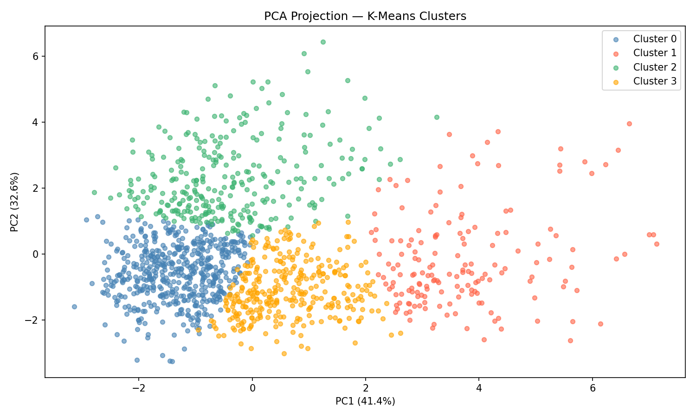

# NBA Player Scoring Prediction — ML Final Project

> Predicting NBA player points per game using supervised learning, clustering, and ensemble methods on season statistics from 2020–2023.

---

## Project Description

This project builds a complete machine learning pipeline to predict NBA player scoring output (points per game) from performance and physical statistics. Starting from raw season data, the pipeline covers exploratory analysis, regression modelling, player role segmentation via clustering, and ensemble methods — each task feeding into the next. The central question is: *can we accurately predict a player's scoring volume from usage, efficiency, and role metrics alone?*

---

## Dataset

| Parameter | Value |
|---|---|
| **Name** | NBA Players Stats (all_seasons.csv) |
| **Source** | https://www.kaggle.com/datasets/justinas/nba-players-data |
| **License** | CC0: Public Domain |
| **Raw size** | 12 844 rows, 22 columns (seasons 1996–2023) |
| **Filtered size** | ~1 318 player-season records (2020–23, ≥ 20 games played) |
| **Target variable** | `pts` — points per game (continuous) |

**Description:** Each row represents one player in one NBA season and includes demographic info (age, height, weight), draft metadata, and on-court performance metrics (points, rebounds, assists, shooting percentages, usage rate, net rating). The dataset is filtered to the three most recent complete seasons to focus on the modern game.

---

## Installation and Setup

### 1. Clone the repository

```bash
cd https://github.com/kuandykovnk2001-afk/ML-midterm-project.git
```

### 2. Install dependencies

```bash
pip install -r requirements.txt
```

### 3. Download the dataset

Download `all_seasons.csv` from [Kaggle](https://www.kaggle.com/datasets/justinas/nba-players-data) and place it at:

```
data/raw/all_seasons.csv
```

### 4. Run notebooks in order

```bash
jupyter notebook notebooks/T1_EDA.ipynb
jupyter notebook notebooks/T2_Supervised.ipynb
jupyter notebook notebooks/T3_Unsupervised.ipynb
jupyter notebook notebooks/T4_Ensemble.ipynb
```

> Notebooks are sequential — each produces files that the next one reads. Always run T1 → T2 → T3 → T4.

---

## Model Results

### Task 2 — Supervised Learning (Regression)

| Model | MAE | RMSE | R² |
|---|---|---|---|
| Linear Regression | ~1.19 | ~1.58 | ~0.94 |
| Decision Tree (max_depth=6) | higher | higher | lower |

**Best Task 2 model:** Linear Regression (R² ≈ 0.94, RMSE ≈ 1.58 PPG). Saved to `models/supervised_best.pkl`. An error of ~1.6 points per game is acceptable for scouting and roster analysis.

### Task 4 — Ensemble Methods

| Model | MAE | RMSE | R² |
|---|---|---|---|
| Linear Regression (T2 baseline) | ~1.19 | ~1.58 | ~0.94 |
| Decision Tree (T2) | — | — | — |
| Random Forest (100 trees, max_depth=10) | — | — | — |
| Gradient Boosting (100 est., lr=0.1) | — | — | — |

> Fill in exact ensemble values from `reports/all_model_results.csv` after running T4.

Ensemble models improve over the Decision Tree and show marginal gains over the Linear Regression baseline. `cluster_label` (player role segment from T3) contributed positively to feature importance in both ensemble models.

---

## Repository Structure

```
your-repo-name/
├── data/
│   ├── raw/                       # Original download — do not modify
│   │   └── all_seasons.csv
│   ├── cleaned.csv                # Output of T1 (~1 318 rows)
│   ├── clustered.csv              # Output of T3 (cleaned + cluster_label)
│   └── supervised_results.csv    # Output of T2 (model metrics table)
├── notebooks/
│   ├── T1_EDA.ipynb               # EDA, data quality audit, 5 visualisations
│   ├── T2_Supervised.ipynb        # Linear Regression + Decision Tree
│   ├── T3_Unsupervised.ipynb      # K-Means + Agglomerative, PCA clusters
│   └── T4_Ensemble.ipynb          # Random Forest + Gradient Boosting
├── models/
│   ├── supervised_best.pkl        # Best Task 2 model (Linear Regression)
│   └── preprocessor.joblib        # Fitted StandardScaler
├── reports/
│   ├── fig1_pts_distribution.png
│   ├── fig2_correlation_matrix.png
│   ├── fig3_usg_vs_pts.png
│   ├── fig4_season_averages.png
│   ├── fig5_height_weight_reb.png
│   ├── fig6_actual_vs_predicted.png
│   ├── fig7_residuals.png
│   ├── fig8_dt_feature_importance.png
│   ├── fig9_elbow_silhouette.png
│   ├── fig10_pca_clusters.png
│   ├── fig11_cluster_profiles.png
│   ├── fig12_ensemble_feature_importance.png
│   ├── fig13_learning_curves.png
│   ├── fig14_model_comparison.png
│   └── all_model_results.csv
├── requirements.txt
└── README.md
```
## Cluster Visualization



---

## Task Summaries

**T1 — EDA:** Raw dataset (12 844 rows) filtered to 3 most recent seasons and players with ≥ 20 games played (~1 318 records). Data quality audit found ~13% missing values in `college` column (filled with `'International'`); no duplicates or impossible values detected. Five visualisations answer specific questions: scoring distribution, correlation matrix, usage rate vs. points, season-over-season averages, and height/weight vs. rebounds.

**T2 — Supervised Learning:** Two engineered features: `efficiency_score = ts_pct × usg_pct` (productive possession use) and `reb_ast_ratio = reb / (ast + 0.1)` (role discriminator). Linear Regression and Decision Tree trained with 80/20 split and 5-fold cross-validation. Linear Regression is the best model (R² ≈ 0.94, RMSE ≈ 1.58 PPG).

**T3 — Unsupervised Learning:** 8 on-court metrics used for clustering (pts, reb, ast, usg_pct, ts_pct, ast_pct, oreb_pct, dreb_pct). Elbow Method and Silhouette Score both indicate k=4. K-Means and Agglomerative Clustering both tested; K-Means selected (higher silhouette). Four segments: **Bench Role Players**, **Elite Scorers**, **Rebounders/Bigs**, **Playmakers**. PCA used for 2D visualisation.

**T4 — Ensemble Methods:** Random Forest and Gradient Boosting trained on `clustered.csv` with `cluster_label` as an additional feature. Both compared to the Task 2 Linear Regression baseline using the same test set and metrics. Feature importance confirms `efficiency_score` and `usg_pct` as dominant predictors. Learning curves show healthy convergence with no overfitting.

---

## Author

| Name  |
|---|---|
| [Alimzhan Kuandykov] 
| [Esbol Tynyshtykbay]

---

## References

- Dataset: [NBA Players Data — Kaggle](https://www.kaggle.com/datasets/justinas/nba-players-data) — CC0 Public Domain
- [scikit-learn documentation](https://scikit-learn.org/stable/)
